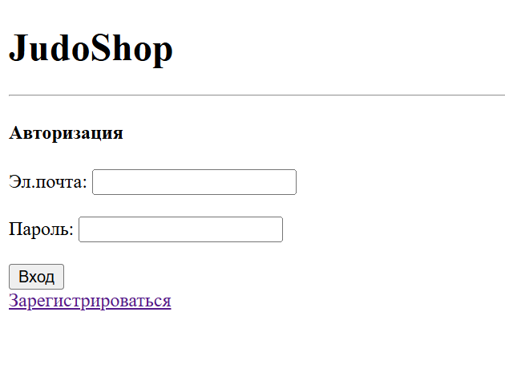
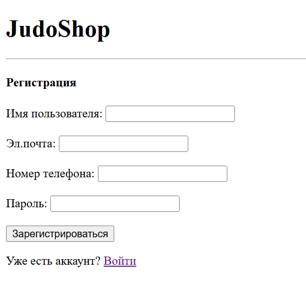
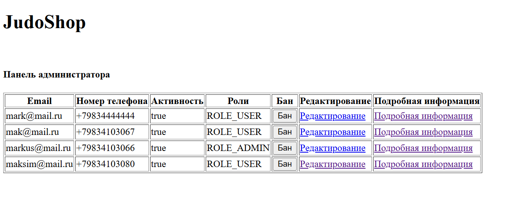
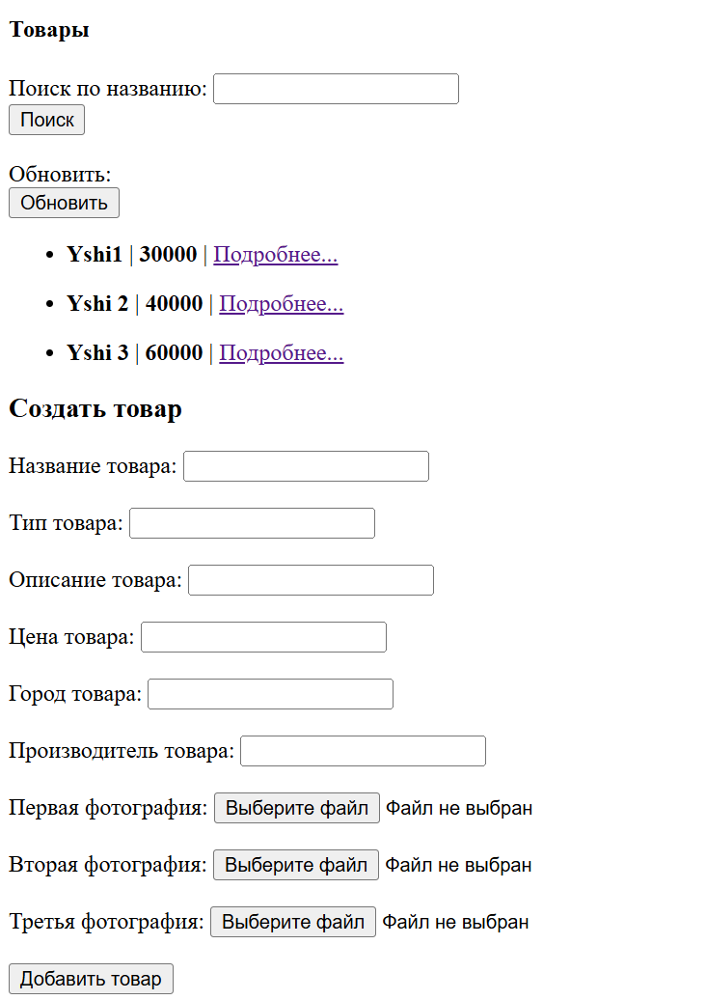
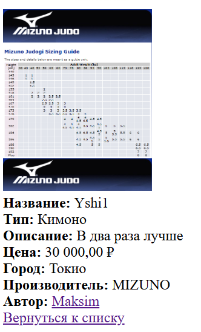

# JudoShop
### Спортивный магазин для дзюдоистов
Веб-приложение для добавления товаров в магазин и управления пользователями со стороны администратора.
Панель администратора позволяет:

✅ Просматривать список пользователей;

✅ Просматривать информацию о пользователях;

✅ Блокировать или разблокировать пользователя;

✅ Редактировать роли.

Со стороны пользователя есть такие функции как:

✅ Добавить товар;

✅ Просмотреть информацию о товаре;

✅ Совершить поиск товара;

### 🛠 Технологии

- **Backend**: Java 21, Spring Boot 3.4.5
- **Frontend**: Bootstrap 5, HTML5
- **База данных**: PostgreSql 
- **Работа с базой данных**: Spring Data
- **Безопасность**: Spring Security, CSRF-токены 

### 🎴 Скриншоты работы
Окно входа

Окно регистрации

Вход как администратор

Добавление товара

Подробная информация о товаре

### 🔄 В процессе разработки

🔄 Доделывается интерфейс
